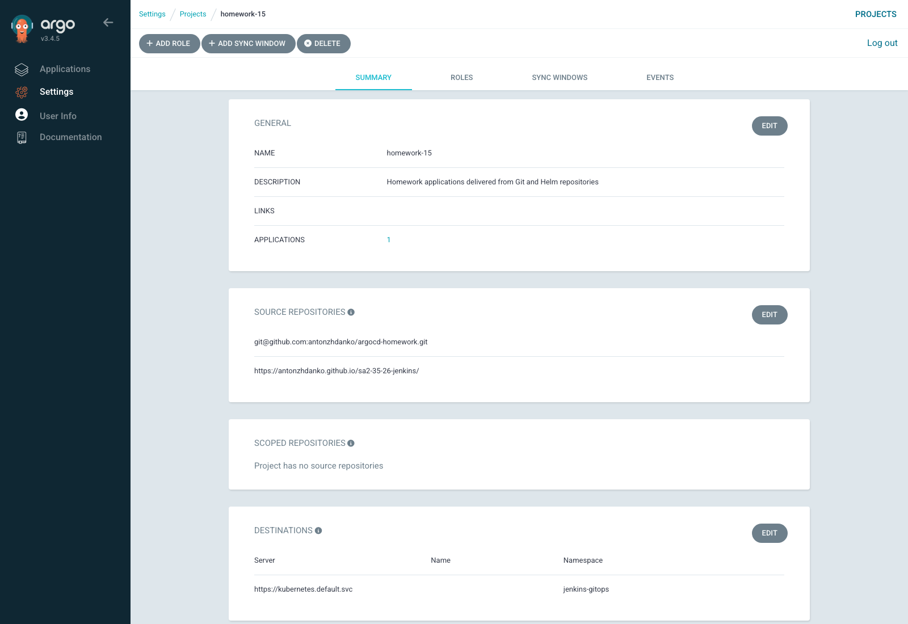
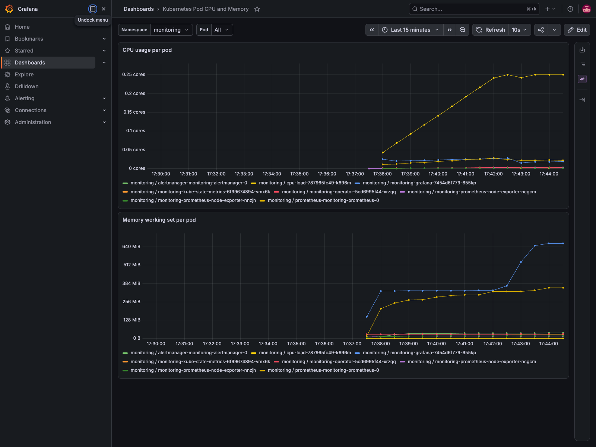
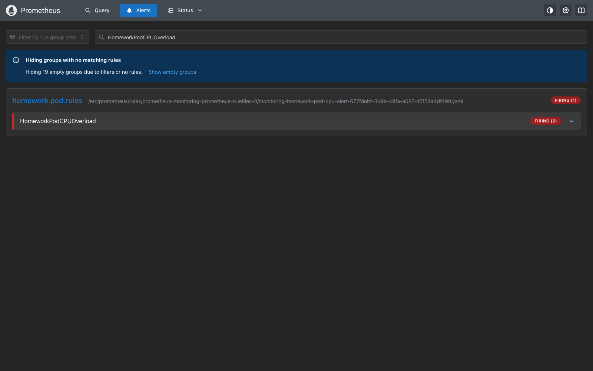

# Argo CD GitOps homework

This separate repository is the declarative source of truth for the Argo CD
homework deployment.

Repository layout:

- `bootstrap/` contains the root Argo CD Application;
- `manifests/` contains the AppProject, child Application and SealedSecrets;
- `infrastructure/` contains the reproducible Argo CD Helm values.

The Jenkins child Application deploys the published
`jenkins-homework` Helm chart from:

```text
https://antonzhdanko.github.io/sa2-35-26-jenkins/
```

No plain-text passwords, access tokens or SSH private keys are committed.

## Argo CD installation

```bash
helm repo add argo https://argoproj.github.io/argo-helm
helm repo update argo
helm upgrade --install argocd argo/argo-cd \
  --version 10.1.3 \
  --namespace argocd \
  --create-namespace \
  --values infrastructure/argocd-values.yaml \
  --wait --timeout 15m
```

The Academy bastion forwards `argocd.k8s-3.sa` to HTTP NodePort `30007`.

## Bootstrap

Only the repository credential and root Application are applied manually. The
remaining resources are reconciled from Git by Argo CD:

```bash
kubectl apply -f manifests/05-repository-sealedsecret.yaml
kubectl apply -f bootstrap/root-application.yaml
```

Expected state:

```text
NAME               PROJECT       SYNC     HEALTHY
homework-15-root   default       Synced   Healthy
jenkins-homework   homework-15   Synced   Healthy
```



## Monitoring

The `monitoring` Argo CD Application deploys `kube-prometheus-stack` chart
`87.15.2` with Prometheus, Alertmanager and Grafana.

- Prometheus: <http://prometheus.k8s-3.sa/>
- Grafana: <http://grafana.k8s-3.sa/>
- CPU alert: `HomeworkPodCPUOverload`
- Grafana dashboard: `Kubernetes Pod CPU and Memory`

The Slack webhook and Grafana password are stored only as SealedSecrets. A
small CPU load pod is deployed to produce a reproducible firing alert.




